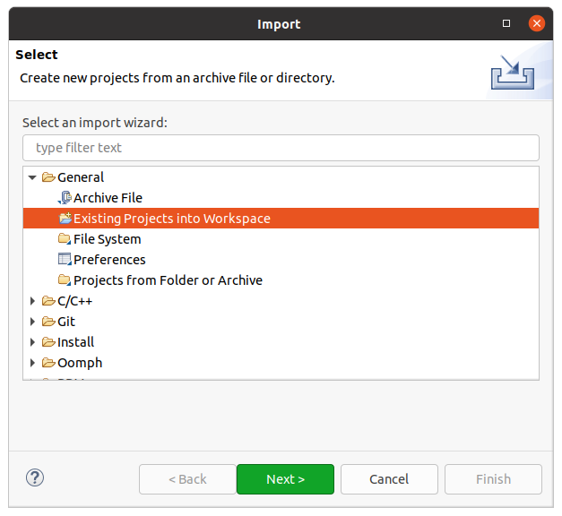
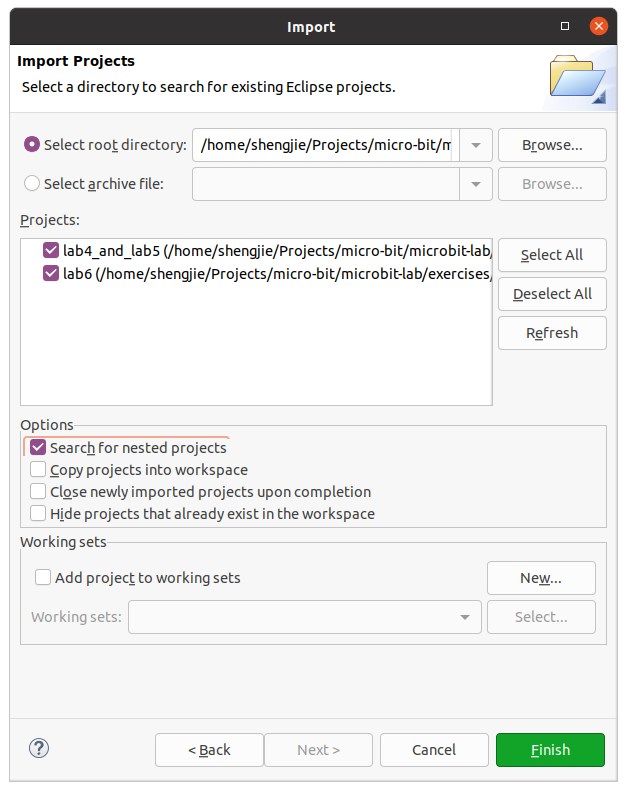
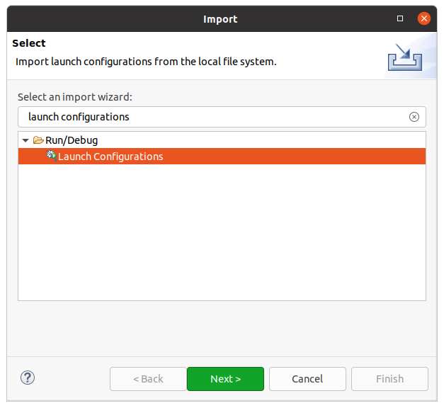
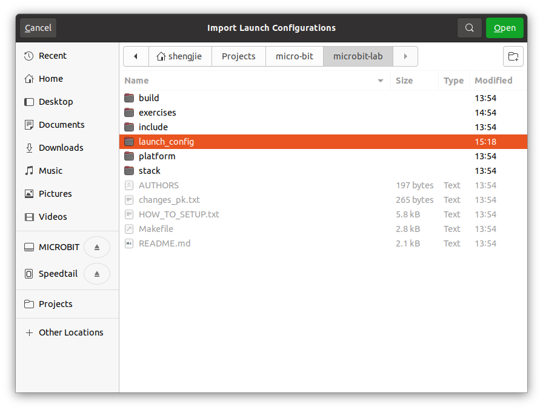
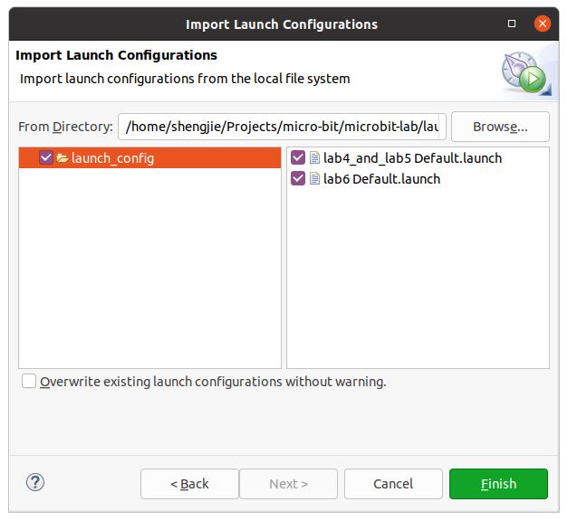
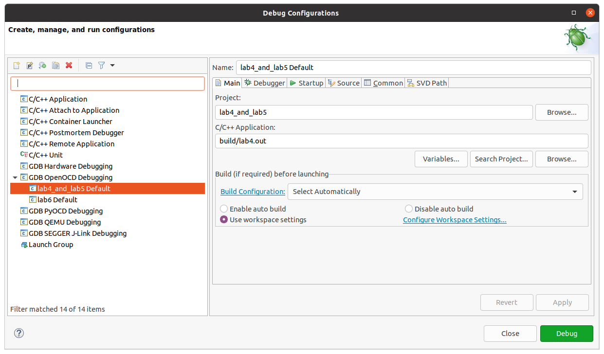

- [About](#about)
- [Setting up the programming environment](#setting-up-the-programming-environment)
  - [Before you start](#before-you-start)
  - [Overview](#overview)
  - [Things we need for compiling code](#things-we-need-for-compiling-code)
    - [Install the GCC cross compiler](#install-the-gcc-cross-compiler)
    - [Download the Nordic SDK](#download-the-nordic-sdk)
    - [Clone this repository](#clone-this-repository)
    - [Check that `make` is installed](#check-that-make-is-installed)
  - [Things we need for debugging](#things-we-need-for-debugging)
    - [Install OpenOCD](#install-openocd)
    - [Install Eclipse IDE](#install-eclipse-ide)
  - [Run an example](#run-an-example)
  - [Run the example in Eclipse](#run-the-example-in-eclipse)
- [Troubleshooting](#troubleshooting)
  - [OpenOCD](#openocd)
  - [Errors Using the Lab Software Project](#errors-using-the-lab-software-project)

# About
This is the lab repository for courses at TU Chemnitz and UNC Chappel Hill. It is developed by Philipp H. Kindt (TU Chemnitz) and Shengjie Xu (UNC Chapel Hill). Large parts of the code are based on the *Blessed (Bluetooth Low Energy Software Stack for Embedded Devices, see https://github.com/pauloborges/blessed)* project. Every file used from blessed - without or with modification - contains the mandatory copyright notice from the Blessed project. The resulting code can be distributed under the same conditions as blessed itself (MIT license - see header files for details). 

# Setting up the programming environment

## Before you start

The content of this guide has been tested on Ubuntu 20.04. While the guide seems long, the instructions are very detailed and we promise there will be less work to do than it seems :)

## Overview

There will be quite a few pieces of software that you need to install in this guide. But don't worry, each of them has a purpose and you should have a good idea of what each of them do by the end of this overview section. Here's a list of things we need

- A **cross compiler**. We will use [arm-none-eabi-gcc](https://developer.arm.com/tools-and-software/open-source-software/developer-tools/gnu-toolchain/gnu-rm/downloads).
- **The Nordic**. This is a collection of libraries—written by the manufacturer of the SoC on the micro:bit board—that enables us to utilize the ARM processor on the micro:bit board. However, the has no knowledge of other components on the board.
- **This repository**, which contains libaries specific to the microbit board.
- **Build tools**. We will use the Ubuntu default build tool `make`.

These are all we need to write code and run it on the micro:bit board. However, to help debugging, it is helpful to set up some additional tools that enables us to debug on the board itself, check the values of the registers, and view the ARM assembly code. To do this, we additionally need:

- An **on-chip debugger**. As the name suggests, it allows us to debug in real time on the micro:bit board. We will use [Open On-Chip Debugger](https://openocd.org/).
- An **IDE** with good support for embedded C programming and debugging. We will use [Eclipse](https://www.eclipse.org/ide/).

There are many pitfalls that eventuelly lead to a failure of the installation. If something goes wrong, please refer to our [troubleshooting](#troubleshooting) section at the end of this document.

## Things we need for compiling code

### Install the GCC cross compiler

This can be easily done in the terminal. Run the following command in the terminal in Ubuntu. (The `$` sign before each line just indicates that the content following it is a command and it needs to be run in the terminal. You *do not* need to enter the `$` sign yourself)

```
$ sudo apt-get update
$ sudo apt-get install gcc-arm-none-eabi
$ sudo apt-get install gdb-multiarch
```

### Download the Nordic SDK

Create an empty directory. This will be your project directory. Download [nRF5_17.0.2](https://www.nordicsemi.com/Software-and-tools/Software/nRF5/Download). Click on nRF5_17.0.2_d674dde.zip (and not the `Download` button, which would download some additional files that you won't need).

### Clone this repository
Put the `microbit_lab` directory alongside the `nRF5_17.0.2_d674dde` folder from last step.

### Check that `make` is installed

Enter the following command in terminal and verify that `make` is installed.
```
$ make --version
```

## Things we need for debugging

### Install OpenOCD

In an ideal world, we would install OpenOCD using `apt-get` just like the cross-compiler, and all the dependencies will be taken care of. Unfortunately, we need to install a newer version that is not updated in the offical `apt-get` repository yet. That requires us to download and compile the source code of OpenOCD.

The OpenOCD installation is prone to failures. Please refer to the [troubleshooting](#troubleshooting) section at the end of this document to solve them.
For more information regarding installing OpenOCD, refer to the `README` file in the `openocd-code` directory.

1. Check if required packages are installed. The `>=` sign means the package version number should be equal to or greater than the version number indicated after the sign.
    - `make`
    - `libtool`
    - `pkg-config >= 0.23` (or compatible)
    - `libusb-1.0-0-dev`
    - `autoconf >= 2.69`
    - `automake >= 1.14`
    - `texinfo >= 5.0`

    To check whether a package is installed and/or what version it is, use the `--version` argument. For example, to check if `pkg-config` is installed and what version it is, run 
    ```
    $ pkg-config --version
    ```
    If any package is missing or needs to be updated, check [this link](https://askubuntu.com/questions/428772/how-to-install-specific-version-of-some-package) for tutorial for installing specific version of a package.

2. Clone the OpenOCD repo (the location doesn't matter)
    ```
    $ git clone git://git.code.sf.net/p/openocd/code openocd-code
    ```

3. Build and install OpenOCD
    ```
    $ cd openocd-code
    $ ./bootstrap
    $ ./configure
    $ make
    $ sudo make install
    ```

4) Grant access to openocd to normal system users. If you already went back to your openocd-code directory, you can omit the first `cd.. ` command.
      ```
      $ cd..
      $ cd contrib
      $ sudo cp 60-openocd.rules /etc/udev/rules.d/
      ```
 
### Install Eclipse IDE

1. Install Eclipse IDE with C/C++ Development Tools (CDT) Download the latest version of [Eclipse IDE](https://www.eclipse.org/downloads). When installing, select `Eclipse IDE for C/C++ Developers`.

2. Install Eclipse plugins

    Within Eclipse IDE, go to `Help -> Install New Software`. In the drop-down menu `Work with`, select the URL that starts with CDT, then search and select the following plugins.

    - C/C++ GCC Cross Compiler Support
    - C/C++ GDB Hardware Debugging
    - C/C++ Memory View Enhancements
    
    Check on the lower left corner of the search box that you have 3 items selected, then click `Next` to finish the installation.

    Repeat the above procedure, this time enter https://download.eclipse.org/embed-cdt/updates/v6/ in the `Work with` menu, click `Add` to the right of the drop-down menu to save it as a available site, and search for 

    - Embedded C/C++ OpenOCD Debugging

    Similarly, add http://embsysregview.sourceforge.net/update as an available site and download 

    - Embedded Systems Register View (SFR)
    - EmbSysRegView Data

## Run an example

Open a terminal window and navigate to `[your_project_dir]/microbit_lab/exercises/lab4_and_lab5`. Then build the project by running `make`:

```
$ cd microbit_lab/exercises/lab1-3
$ make
```

There should now be a `lab1to3.hex` file in the `build` subfolder. You can manually copy it to the microbit drive, or use the OpenOCD interface:

```
$ chmod +x flash_openocd.sh
$ ./flash_openocd.sh
```

If this step fails with the warning "Error: unable to find a matching CMSIS-DAP device", try running 
```
$ sudo ./flash_openocd.sh
```
and see if it works. If this succeeds while it doesn't work without `sudo`, there's a permission issue with the OpenOCD interface. Though we have already granted the right permissions, please follow the steps described in the "Other Linux distros" section in [this link](https://forgge.github.io/theCore/guides/running-openocd-without-sudo.html) to make it work without using `sudo`.

You should now be able to see the LEDs on board blinking.

## Run the example in Eclipse
1. Open Eclipse IDE. Select "File" -> "Import", then under "General", select "Import Existing Projects into Workspace". Click "Next". 
2. Select the `microbit-lab` folder. Check "Search for nested projects". The lab projects should appear. Select all of them and click "Finish".  
3. Select "File" -> "Import" again. This time under "Run/Debug", select "Launch Configurations". 
4. Select `microbit-lab/launch-config` folder. Click "Next", and import all configuration files.  
5. Click in the menu "Run" -> "Debug Configurations". Under "GDB OpenOCD Debugging" there should be two configurations. Select `lab4_and_lab5 Default` and click "Debug". You are now debugging the code directly on the microbit board! 


# Troubleshooting
We here list solutions for all errors that might arise during the installation we are aware of.

## OpenOCD
**Error Message: "configure: error jimttcl not found, run `git submodule init` and `git submodule update`"**

In your openocd-code directory, type:
```
$ cd src/jtag/drivers/libjaylink
$./autogen.sh
```
then, go back to your openocd-code folder:
```
$ cd ../../../..
```

Please type:
```
git submodule init
git submodule update
```

**Error Message: Unable to access 'XY': server certificate verification failed.**

Please type
```
$ git config --global http.sslverify false
```
(Thanks to Bo-Yue Zeng for reporting this problem and solution)

## Errors Using the Lab Software Project
**"nrf_gpio.h" is not found**

Your directory structure is probably wrong, such that files from the nRF52 SDK cannot be found.
The structure should look like this:
 ```
  /
  |- nRF5_SDK_17.0.2_d674dde
  |- microbit_lab-main
```
Hence, the nRF52 SDK and our lab source code should form subdirectories of the same directory. Don't make nRF5_SDK_17.0.2_d674dde SDK a subfolder of microbit_lab-main!

**Debugging in Eclipse fails with "Error: unable to find matching CMSIS-DAP device"**

in your openocd-code directory, type:
 ```
$ cd contrib
$ sudo cp 60-openocd.rules /etc/udev/rules.d/
```
